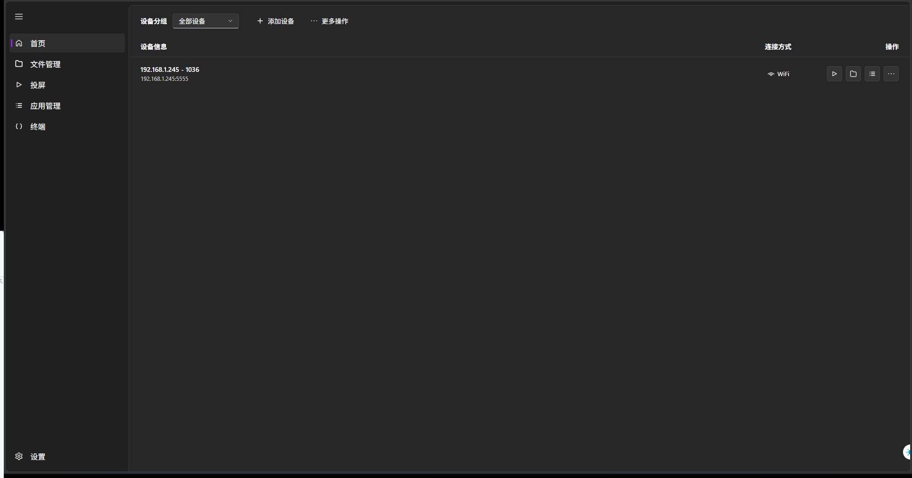
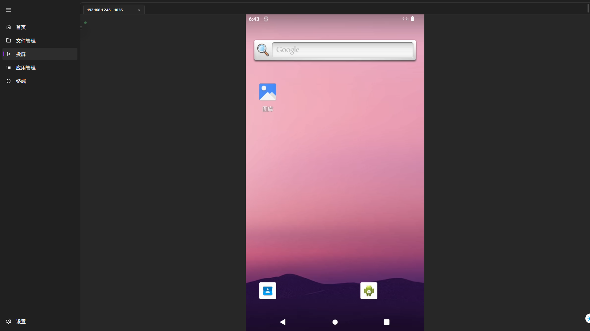
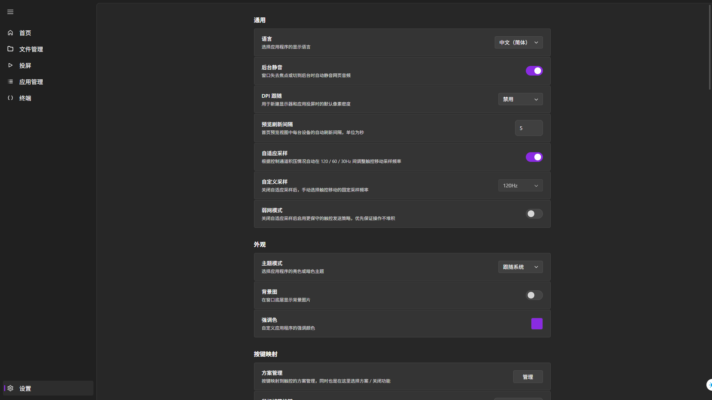
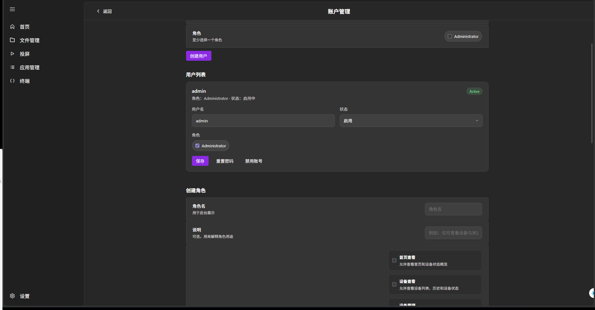

# AYLink

[](../LICENSE)
[](https://www.codefactor.io/repository/github/5656565566/aylink.extra)


**English** | [简体中文](README_CN.md)

**AYLink** is an Android device management and screen casting solution built on top of [scrcpy](https://github.com/Genymobile/scrcpy) and WebRTC. This repository currently includes:

- `AYLink.Agent`: the Go backend service responsible for ADB, scrcpy, authentication, device management, and WebRTC signaling
- `AYLink.Web`: the Vue 3 based web management UI
- `AYLink.Mobile`: the native Android mobile client, providing device list, remote casting, app management, file management, and terminal features
- If you are looking for the local desktop client, [AYLink](https://github.com/5656565566/AYLink) contains a cross-platform desktop app with better performance
- That desktop client can currently connect to `AYLink.Agent` with limited support

> [!TIP]
> The project is still evolving. The core features are already usable, but compatibility issues may still appear across different devices, networks, and encoder environments. Issues and PRs are welcome.

## ✨ Features

- **Low-latency casting and control**: built on scrcpy + WebRTC, with touch, keyboard, mouse, and HID input support
- **Casting key mapping**: map keyboard and mouse input to touch actions with key mapping profiles
- **Device management**: view online devices, connection states, wireless ADB pairing, and common actions
- **File management**: browse, download, delete, and rename files on the device
- **App management**: list installed apps, launch them, and start app-level casting
- **Terminal access**: access the device shell over WebSocket
- **Accounts and permissions**: built-in local accounts, roles, and server-side RBAC
- **WebRTC network configuration**: supports STUN/TURN, host candidate override, and single-port mapping

## 📸 Screenshots

| **Main View** | **Casting View** |
| :---: | :---: |
|  |  |
| **Main Settings** | **Permission Settings** |
|  |  |

- Deploy and try it out to experience more features

## 🚀 Quick Start

### Prerequisites

1. Enable **Developer options** on your Android device
2. Enable **USB debugging**
3. If you want wireless debugging, enable it depending on your Android version, or establish ADB over USB first
4. Prepare `adb`

### Option 1: Run locally for development

1. Install dependencies:
   - Go 1.25+
   - Node.js 20+
   - Android ADB
2. Copy the config file
3. Adjust the ADB and `scrcpy-server` paths in [config.example.json](F:/project/csharp_app/AYLink.Extra/AYLink.Agent/config.example.json) according to your environment
4. Start the backend:

```powershell
cd AYLink.Agent
go run ./cmd/agent
```

5. On first startup, the server automatically creates an initial admin account:
   - Username is always `admin`
   - Password is randomly generated and printed in the server console
6. Open `http://127.0.0.1:5501` in your browser

### Option 2: Build frontend and run locally with one command

The repository root includes a `Makefile`:

```bash
make run
```

Common commands:

- `make web`: build web assets
- `make agent`: build multi-platform Agent binaries
- `make clean`: clean build artifacts

### Option 3: Run with Docker

Use the included [docker-compose.yml](F:/project/csharp_app/AYLink.Extra/docker-compose.yml):

```bash
docker compose up -d
```

By default it exposes:

- HTTP management port: `5501`

The container image already includes:

- `android-tools`, so `adb` is available directly
- the required `scrcpy-server`

If your deployment environment has special ADB or WebRTC networking requirements, you can combine:

- environment variables
- mounting `config.json`
- `network_mode: host`

## ⚙️ Configuration

The default server configuration example is available in [config.example.json](F:/project/csharp_app/AYLink.Extra/AYLink.Agent/config.example.json).

Environment variables take precedence over `config.json`. Common options include:

- `AYLINK_HTTP_LISTENADDR`
- `AYLINK_DB_PATH`
- `AYLINK_ADB_PATH`
- `AYLINK_ADB_SERVERHOST`
- `AYLINK_ADB_SERVERPORT`
- `AYLINK_ADB_BUNDLEDDIR`

## 📡 WebRTC Deployment Notes

If you only use AYLink on a local network, the default configuration is usually enough.  
If you need screen casting across the public internet, choose one of these approaches depending on your network environment:

### Option 1: STUN / TURN

Suitable for standard WebRTC deployment:

- Configure STUN or TURN servers in the settings page
- Optionally use the `all` or `relay` transport policy
- `relay` mode forces traffic through TURN

### Option 2: Host Candidate Override

Suitable when you know the server's public address and do not want to rely on STUN/TURN:

- Enable direct host candidate override
- Fill in a public IPv4 address or another reachable public endpoint

### Option 3: Single-Port Mapping

Suitable for FRP, port forwarding, or restricted network environments:

- Enable single-port mapping mode
- Specify a fixed local UDP listening port on the server
- If the externally exposed port is different, also fill in the published port

Suggestions:

- If ICE candidates are coming from too many sources, clear unneeded STUN/TURN settings first and troubleshoot step by step
- The current casting page already supports automatic reconnection for short network interruptions

## 🔐 Authentication and Permissions

The current version includes a built-in local account system:

- An admin account is created automatically on first startup
- Save the password carefully, because it is shown only once
- It is recommended to change the password immediately after the first login

## 🛠️ Development and Build

### Frontend

```bash
cd AYLink.Web
npm install
npm run build
```

In development mode, Vite proxies API requests to `http://127.0.0.1:5501` by default.

### Backend

```bash
cd AYLink.Agent
go build ./...
```

### Full Build

```bash
make agent
```

This generates Agent executables for:

- Windows `amd64 / arm64`
- Linux `amd64 / arm64 / loong64 ...`
- macOS `amd64 / arm64`

### Agent API Documentation

```bash
make make api-docs
make api-docs-serve
```

Then visit http://127.0.0.1:18080/ to read the documentation.
You can change the backend address with:

```bash
make api-docs-serve API_DOCS_ARGS="-api-base-url http://127.0.0.1:5502"
```

The default backend address uses the local `5501` port.

## 📦 Dependencies and Credits

This project is built with help from the following open source projects:

| Project | Description |
|------|------|
| [scrcpy](https://github.com/Genymobile/scrcpy) | Provides the core screen mirroring and control capability |
| [go-adbkit](https://github.com/codeskyblue/go-adbkit) | A partially modified codebase used for easier ADB management |
| [pion](https://github.com/pion/webrtc) | A set of Pion WebRTC related libraries |
| [opus](https://github.com/jj11hh/opus) | Uses a WASM encoder to avoid CGO |
| [websocket](https://github.com/gorilla/websocket) | Go implementation of the WebSocket protocol |
| [sqlite](modernc.org/sqlite) | Provides database support |

## 📄 License

This project is licensed under [Apache-2.0](../LICENSE).
